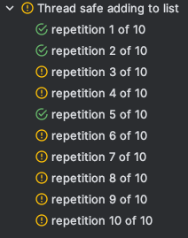

## About

`Threads Collider` allows to start multiple threads with desired functionality at "exactly" same moment for testing purposes
to manifest concurrency issues.

## Overview

```java
@RepeatedTest(10)
void Thread_safe_adding_to_list(){
    // Given
    List<String> list = new ArrayList<>();    // <-- NOT thread safe
    int threadsCount = Runtime.getRuntime().availableProcessors();

    // When
    try (ThreadsCollider threadsCollider =
        threadsCollider().withThreadsCount(threadsCount).build()) {
        
        threadsCollider.collide(()->list.add("bar"));
    }

    // Then
    then(list).hasSize(threadsCount).containsOnly("bar");
}
```

#### Output



#### Example failure

```bash
java.lang.AssertionError: 
Expecting ArrayList:
  [null, null, null, null, null, null, "bar", "bar"]
to contain only:
  ["bar"]
but the following element(s) were unexpected:
  [null, null, null, null, null, null]
```

#### Fixed version

```java
@RepeatedTest(10)
void Thread_safe_adding_to_list(){
    // Given
    List<String> list = Collections.synchronizedList(new ArrayList<>()); // <-- thread safe
    int threadsCount = Runtime.getRuntime().availableProcessors();

    // When
    try (ThreadsCollider threadsCollider = 
        threadsCollider().withThreadsCount(threadsCount).build()) {
        
        threadsCollider.collide(()->list.add("bar"));
    }

    // Then
    then(list).hasSize(threadsCount).containsOnly("bar");
}
```

### Usage

- You can create `ThreadsCollider` using `ThreadsColliderBuilder`.
- Use `junit5` `@RepeatedTest` annotation to run test multiple times to increase chance of manifesting concurrency issues.

```java
@RepeatedTest(10)                             // run test multiple times to increase chance of manifesting concurrency issues
void Adding_unique_apples_is_thread_safe(){
    // Given
    UniqueApples uniqueApples=UniqueApples.newInstance();

    // When
    try (ThreadsCollider threadsCollider =    // use try-with-resources to automatically shutdown threads collider
        threadsCollider()
            .withAvailableProcessors()        // or withThreadsCount(CUSTOM_THREADS_COUNT)
            .withAwaitTerminationTimeout(10)  // optional, default 60 seconds
            .asSeconds()                      // optional - related only to "withAwaitTerminationTimeout()", default TimeUnit.SECONDS
            .build()) {
        
        threadsCollider.collide(()->uniqueApples.add(RED_DELICIOUS)); // <-- code to be executed simultaneously at "exactly" same moment
    }

    // Then
    then(uniqueApples).hasSize(1).containsExactlyInAnyOrder(RED_DELICIOUS);
}
```

## Requirements

- Java 8+

## Dependencies

---

### Maven

```xml 

<dependency>
    <groupId>pl.amazingcode</groupId>
    <artifactId>threads-collider</artifactId>
    <version>1.0.0</version>
</dependency>
```

### Gradle

```groovy
implementation group: 'pl.amazingcode', name: 'threads-collider', version: "1.0.0"
```